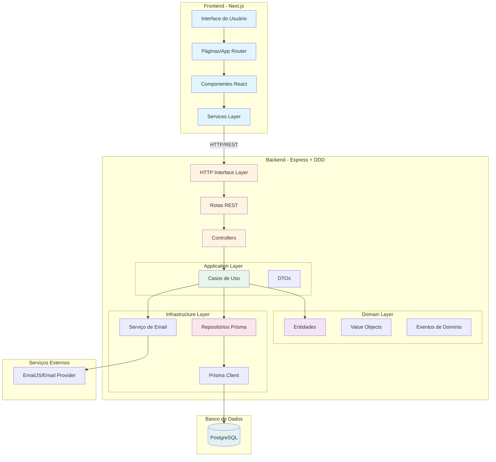

# Documento de Arquitetura - Plataforma de Gestão para Grupos de Networking

## 1. Visão Geral

Este documento descreve a arquitetura completa da plataforma de gestão para grupos de networking, projetada para digitalizar e otimizar a gestão de membros e suas interações. A solução foi desenvolvida utilizando **Domain-Driven Design (DDD)** como padrão arquitetural, garantindo separação de responsabilidades, testabilidade e escalabilidade.

### 1.1 Princípios Arquiteturais

- **Domain-Driven Design (DDD)**: Organização do código em camadas de domínio, aplicação, infraestrutura e interfaces
- **Separation of Concerns**: Cada camada possui responsabilidades bem definidas
- **Dependency Inversion**: Camadas superiores dependem de abstrações (ports), não de implementações concretas
- **Clean Architecture**: Independência do framework e do banco de dados

## 2. Diagrama da Arquitetura



### 2.1 Fluxo de Dados

1. **Requisição HTTP**: Cliente (Frontend) faz requisição HTTP para o Backend
2. **Roteamento**: Express roteia para o controller apropriado
3. **Validação**: Zod valida os dados de entrada
4. **Casos de Uso**: Controller invoca o caso de uso correspondente
5. **Domínio**: Caso de uso orquestra entidades e regras de negócio
6. **Persistência**: Repositório (via Prisma) persiste/recupera dados
7. **Resposta**: Dados são retornados ao cliente em formato JSON padronizado

## 3. Modelo de Dados

### 3.1 Escolha do Banco de Dados

**PostgreSQL** foi escolhido como banco de dados relacional pelas seguintes razões:

- **ACID Compliance**: Garante consistência transacional para operações críticas
- **Relacionamentos Complexos**: Suporta relacionamentos entre entidades (membros, indicações, aplicações)
- **Performance**: Excelente desempenho para consultas complexas e relatórios
- **Maturidade**: Ferramentas maduras (Prisma ORM) e ampla comunidade
- **Escalabilidade**: Suporta crescimento futuro com índices e otimizações
- **Integridade Referencial**: Foreign keys garantem consistência dos dados

### 3.2 Schema do Banco de Dados

O schema foi implementado utilizando **Prisma ORM** e está definido em `backend/prisma/schema.prisma`. Todas as tabelas utilizam **CUID** (Collision-resistant Unique Identifier) como identificador primário, garantindo unicidade e segurança.

#### 3.2.1 Enums Implementados

##### **ApplicationStatus**
Enum que representa o status de uma intenção de participação:

```prisma
enum ApplicationStatus {
  PENDING    // Aguardando aprovação
  APPROVED   // Aprovada pelo administrador
  REJECTED   // Recusada pelo administrador
}
```

##### **ReferralStatus**
Enum que representa o status de uma indicação de negócio:

```prisma
enum ReferralStatus {
  NEW         // Nova indicação
  IN_CONTACT  // Em contato com a oportunidade
  CLOSED      // Negócio fechado
  DECLINED    // Indicação recusada
}
```

#### 3.2.2 Tabelas Implementadas

##### **Member** (Membros)
Representa os membros ativos do grupo de networking que foram cadastrados através do fluxo de convite.

**Schema Prisma:**
```prisma
model Member {
  id             String      @id @default(cuid())
  name           String
  email          String      @unique
  company        String?
  joinedAt       DateTime    @default(now())
  isActive       Boolean     @default(true)
  referralsFrom  Referral[]  @relation("ReferralsFrom")
  referralsTo    Referral[]  @relation("ReferralsTo")
}
```

**Campos:**
- `id` (String, PK): Identificador único gerado com CUID
- `name` (String): Nome completo do membro
- `email` (String, UNIQUE): Email único do membro (usado para identificação)
- `company` (String?, opcional): Nome da empresa do membro
- `joinedAt` (DateTime): Data e hora de ingresso no grupo (automático)
- `isActive` (Boolean): Flag para controlar membros ativos/inativos (default: true)

**Relacionamentos:**
- `referralsFrom` (Referral[]): Relação um-para-muitos com indicações feitas pelo membro
- `referralsTo` (Referral[]): Relação um-para-muitos com indicações recebidas pelo membro

**Índices:**
- Índice único em `email` (garantido pelo constraint UNIQUE)

##### **Application** (Intenções de Participação)
Armazena as solicitações de pessoas interessadas em participar do grupo. Essas intenções são submetidas através do formulário público e aguardam aprovação do administrador.

**Schema Prisma:**
```prisma
model Application {
  id         String             @id @default(cuid())
  name       String
  email      String
  company    String?
  motivation String
  status     ApplicationStatus  @default(PENDING)
  createdAt  DateTime           @default(now())
  invite     Invite?
}
```

**Campos:**
- `id` (String, PK): Identificador único gerado com CUID
- `name` (String): Nome completo do candidato
- `email` (String): Email do candidato
- `company` (String?, opcional): Empresa do candidato
- `motivation` (String): Texto explicando a motivação para participar do grupo
- `status` (ApplicationStatus): Status da aplicação (default: PENDING)
- `createdAt` (DateTime): Data e hora de criação (automático)

**Relacionamentos:**
- `invite` (Invite?, opcional): Relação um-para-um com o convite gerado quando a aplicação é aprovada

**Comportamento:**
- Quando uma aplicação é aprovada, um registro `Invite` é criado automaticamente
- Apenas aplicações com status `APPROVED` podem ter um convite associado

##### **Invite** (Convites)
Representa o token de convite gerado automaticamente quando uma aplicação é aprovada. O token permite acesso ao formulário de cadastro completo.

**Schema Prisma:**
```prisma
model Invite {
  id            String       @id @default(cuid())
  token         String       @unique
  applicationId String       @unique
  application   Application  @relation(fields: [applicationId], references: [id])
  expiresAt     DateTime
  usedAt        DateTime?
}
```

**Campos:**
- `id` (String, PK): Identificador único gerado com CUID
- `token` (String, UNIQUE): Token único e seguro para acesso ao formulário de cadastro
- `applicationId` (String, UNIQUE, FK): Referência à aplicação aprovada (relação um-para-um)
- `expiresAt` (DateTime): Data e hora de expiração do token (configurável via `INVITE_EXPIRATION_DAYS`)
- `usedAt` (DateTime?, opcional): Data e hora em que o token foi utilizado (null se não usado)

**Relacionamentos:**
- `application` (Application): Relação um-para-um com a aplicação que gerou o convite

**Comportamento:**
- Token é gerado automaticamente ao aprovar uma aplicação
- Token expira após período configurado (padrão: 7 dias)
- Uma vez usado (`usedAt` preenchido), o token não pode ser reutilizado
- Cada aplicação aprovada gera exatamente um convite

**Índices:**
- Índice único em `token` para busca rápida
- Índice único em `applicationId` garantindo relação um-para-um

##### **Referral** (Indicações)
Representa indicações de negócios entre membros do grupo. Permite que membros indiquem oportunidades de negócio uns para os outros e acompanhem o status dessas indicações.

**Schema Prisma:**
```prisma
model Referral {
  id                String    @id @default(cuid())
  fromMemberId      String
  toMemberId        String
  companyOrContact  String
  description       String
  status            ReferralStatus @default(NEW)
  createdAt         DateTime  @default(now())
  updatedAt         DateTime  @updatedAt
  fromMember        Member    @relation("ReferralsFrom", fields: [fromMemberId], references: [id], onDelete: Cascade)
  toMember          Member    @relation("ReferralsTo", fields: [toMemberId], references: [id], onDelete: Cascade)
}
```

**Campos:**
- `id` (String, PK): Identificador único gerado com CUID
- `fromMemberId` (String, FK): ID do membro que fez a indicação
- `toMemberId` (String, FK): ID do membro que recebeu a indicação
- `companyOrContact` (String): Nome da empresa ou contato indicado
- `description` (String): Descrição detalhada da oportunidade de negócio
- `status` (ReferralStatus): Status atual da indicação (default: NEW)
- `createdAt` (DateTime): Data e hora de criação (automático)
- `updatedAt` (DateTime): Data e hora da última atualização (automático, atualizado a cada modificação)

**Relacionamentos:**
- `fromMember` (Member): Relação muitos-para-um com o membro que fez a indicação
- `toMember` (Member): Relação muitos-para-um com o membro que recebeu a indicação

**Comportamento:**
- `fromMemberId` e `toMemberId` devem ser diferentes (validação no caso de uso)
- Quando um membro é deletado, todas suas indicações (feitas e recebidas) são deletadas em cascata
- Apenas o membro que fez a indicação (`fromMember`) pode atualizar o status
- O campo `updatedAt` é atualizado automaticamente pelo Prisma a cada modificação

**Índices:**
- Índices em `fromMemberId` e `toMemberId` para consultas rápidas de listagem
- Índice em `status` para filtros por status
- Índice em `createdAt` para ordenação cronológica

#### 3.2.3 Diagrama de Relacionamentos

```
┌─────────────┐
│   Member    │
│             │
│ - id (PK)   │◄──────┐
│ - email     │       │
│ - name      │       │
│ - company   │       │
│ - joinedAt  │       │
│ - isActive  │       │
└─────────────┘       │
       │              │
       │              │
       │ 1:N          │ 1:N
       │              │
       ▼              ▼
┌─────────────┐  ┌─────────────┐
│  Referral   │  │  Referral   │
│             │  │             │
│ - id (PK)   │  │ - id (PK)   │
│ - fromId    │  │ - fromId    │
│ - toId      │  │ - toId      │
│ - status    │  │ - status    │
└─────────────┘  └─────────────┘
       ▲              ▲
       │              │
       │              │
       │              │
┌─────────────┐       │
│ Application │       │
│             │       │
│ - id (PK)   │       │
│ - status    │       │
│ - email     │       │
│ - name      │       │
└─────────────┘       │
       │              │
       │ 1:1          │
       │              │
       ▼              │
┌─────────────┐       │
│   Invite    │       │
│             │       │
│ - id (PK)   │       │
│ - token     │       │
│ - expiresAt │       │
│ - usedAt    │       │
└─────────────┘       │
                      │
                      │
         (quando usado, cria Member)
```

#### 3.2.3 Tabelas Futuras (Não Implementadas)

Para completar todas as funcionalidades do escopo, as seguintes tabelas seriam necessárias:

##### **Announcement** (Avisos e Comunicados)
```sql
CREATE TABLE "Announcement" (
  id          TEXT PRIMARY KEY,
  title       TEXT NOT NULL,
  content     TEXT NOT NULL,
  authorId    TEXT NOT NULL,
  publishedAt TIMESTAMP,
  createdAt   TIMESTAMP DEFAULT NOW(),
  FOREIGN KEY (authorId) REFERENCES "Member"(id)
);
```

##### **Meeting** (Reuniões)
```sql
CREATE TABLE "Meeting" (
  id          TEXT PRIMARY KEY,
  title       TEXT NOT NULL,
  date        TIMESTAMP NOT NULL,
  location    TEXT,
  description TEXT,
  createdAt   TIMESTAMP DEFAULT NOW()
);
```

##### **Attendance** (Presença em Reuniões)
```sql
CREATE TABLE "Attendance" (
  id        TEXT PRIMARY KEY,
  meetingId TEXT NOT NULL,
  memberId  TEXT NOT NULL,
  checkedIn BOOLEAN DEFAULT false,
  checkedInAt TIMESTAMP,
  FOREIGN KEY (meetingId) REFERENCES "Meeting"(id),
  FOREIGN KEY (memberId) REFERENCES "Member"(id),
  UNIQUE(meetingId, memberId)
);
```

##### **OneOnOne** (Reuniões 1 a 1)
```sql
CREATE TABLE "OneOnOne" (
  id          TEXT PRIMARY KEY,
  member1Id   TEXT NOT NULL,
  member2Id   TEXT NOT NULL,
  scheduledAt TIMESTAMP NOT NULL,
  notes       TEXT,
  status      TEXT DEFAULT 'SCHEDULED', -- SCHEDULED, COMPLETED, CANCELLED
  FOREIGN KEY (member1Id) REFERENCES "Member"(id),
  FOREIGN KEY (member2Id) REFERENCES "Member"(id)
);
```

##### **ThankYou** (Obrigados)
```sql
CREATE TABLE "ThankYou" (
  id          TEXT PRIMARY KEY,
  referralId  TEXT NOT NULL,
  fromMemberId TEXT NOT NULL,
  toMemberId   TEXT NOT NULL,
  message     TEXT NOT NULL,
  createdAt   TIMESTAMP DEFAULT NOW(),
  FOREIGN KEY (referralId) REFERENCES "Referral"(id),
  FOREIGN KEY (fromMemberId) REFERENCES "Member"(id),
  FOREIGN KEY (toMemberId) REFERENCES "Member"(id)
);
```

##### **Payment** (Mensalidades)
```sql
CREATE TABLE "Payment" (
  id          TEXT PRIMARY KEY,
  memberId    TEXT NOT NULL,
  amount      DECIMAL(10,2) NOT NULL,
  dueDate     DATE NOT NULL,
  paidAt      TIMESTAMP,
  status      TEXT DEFAULT 'PENDING', -- PENDING, PAID, OVERDUE
  createdAt   TIMESTAMP DEFAULT NOW(),
  FOREIGN KEY (memberId) REFERENCES "Member"(id)
);
```

##### **DashboardMetric** (Métricas de Performance)
```sql
CREATE TABLE "DashboardMetric" (
  id          TEXT PRIMARY KEY,
  memberId    TEXT,
  metricType  TEXT NOT NULL, -- INDIVIDUAL, GROUP
  period      TEXT NOT NULL, -- WEEKLY, MONTHLY, YEARLY
  value       JSONB NOT NULL,
  calculatedAt TIMESTAMP DEFAULT NOW(),
  FOREIGN KEY (memberId) REFERENCES "Member"(id)
);
```

### 3.3 Índices e Otimizações

O Prisma cria automaticamente índices para campos com constraint `@unique` e foreign keys. Os seguintes índices são criados automaticamente:

**Índices Automáticos (via Prisma):**
- `Member.email`: Índice único (constraint UNIQUE)
- `Invite.token`: Índice único (constraint UNIQUE)
- `Invite.applicationId`: Índice único (constraint UNIQUE)
- Foreign keys em `Referral.fromMemberId` e `Referral.toMemberId` (índices para joins)

**Índices Recomendados para Performance Futura:**

Para otimizar consultas frequentes, os seguintes índices podem ser adicionados via migrations do Prisma:

```prisma
// Exemplo de migration futura para adicionar índices
// Estes índices melhorariam performance em:
// - Filtros por status de aplicações
// - Listagens ordenadas por data
// - Busca de convites expirados não utilizados
// - Filtros por status de indicações

// Application
@@index([status])
@@index([createdAt(sort: Desc)])

// Invite  
@@index([expiresAt], where: { usedAt: null })

// Referral
@@index([status])
@@index([createdAt(sort: Desc)])
```

**Otimizações Implementadas:**
- Paginação em todas as listagens (reduz carga no banco)
- Consultas paralelas usando `Promise.all()` nos repositórios
- Uso de `select` específico quando necessário (não implementado, mas recomendado)
- Cascade delete em relacionamentos críticos (`Referral` → `Member`)

**Considerações de Performance:**
- O uso de CUID como PK garante distribuição uniforme, mas pode impactar performance em tabelas muito grandes
- Para escalabilidade futura, considerar índices compostos para queries complexas
- Monitorar queries lentas e adicionar índices conforme necessário

## 4. Estrutura de Componentes (Frontend)

### 4.1 Organização de Pastas

O frontend Next.js utiliza o **App Router** e segue uma estrutura modular baseada em features e componentes reutilizáveis:

```
frontend/
├── app/                          # App Router (Next.js 14+)
│   ├── (public)/                 # Grupo de rotas públicas
│   │   ├── apply/               # Página de intenção de participação
│   │   └── register/            # Página de cadastro com token
│   ├── admin/                    # Área administrativa
│   │   └── applications/        # Gestão de intenções
│   ├── referrals/                # Sistema de indicações
│   ├── layout.tsx                # Layout raiz
│   └── page.tsx                  # Página inicial
│
├── components/                    # Componentes React
│   ├── Layouts/                  # Componentes de layout
│   │   ├── sidebar/             # Sidebar e navbar
│   │   └── showcase-section/    # Seções de conteúdo
│   ├── FormElements/             # Componentes de formulário
│   │   └── InputGroup/          # Input reutilizável
│   ├── ui/                       # Componentes UI base (shadcn/ui style)
│   │   └── table/               # Tabela reutilizável
│   └── ui-elements/             # Elementos UI específicos
│       ├── alert/               # Alertas e notificações
│       └── modal/               # Modais
│
├── services/                      # Camada de serviços
│   └── ConnexaApi/              # Clientes API organizados por feature
│       ├── Application/         # API de aplicações
│       ├── Admin/               # API administrativa
│       ├── Register/            # API de registro
│       └── Referrals/           # API de indicações
│
├── lib/                          # Utilitários e helpers
│   ├── api/                     # Configuração do cliente HTTP
│   └── utils/                    # Funções utilitárias
│
├── hooks/                        # Custom React Hooks
├── types/                        # Definições TypeScript
└── css/                          # Estilos globais
```

### 4.2 Padrões de Componentização

#### 4.2.1 Componentes de Layout
- **Sidebar**: Navegação lateral reutilizável
- **Navbar**: Barra de navegação superior
- **ShowcaseSection**: Container padronizado para seções de conteúdo

#### 4.2.2 Componentes de Formulário
- **InputGroup**: Input reutilizável com label, validação e estados de erro
- Componentes seguem padrão de **controlled components** (React)

#### 4.2.3 Componentes UI Base
- **Table**: Tabela reutilizável com suporte a dark mode
- **Alert**: Sistema de alertas com variantes (success, error, warning)
- **Modal**: Modal reutilizável para ações secundárias

#### 4.2.4 Estado Global

Atualmente, o projeto **não utiliza** estado global (Redux, Zustand, etc.) porque:

- A aplicação é relativamente simples
- O estado é gerenciado localmente via React hooks (`useState`, `useEffect`)
- Comunicação entre componentes é feita via props e callbacks
- **Futuro**: Se necessário, pode-se adicionar Context API ou Zustand para estado compartilhado (ex: autenticação de membro)

### 4.3 Estrutura de Páginas

#### 4.3.1 Páginas Públicas (`app/(public)/`)

**`/apply`** - Formulário de Intenção
- Componente: `ApplyPage`
- Estado local para formulário
- Integração com `ApplicationApi`
- Validação client-side

**`/register?token=xxx`** - Cadastro Completo
- Componente: `RegisterPage`
- Validação de token via query string
- Integração com `RegisterApi`
- Envio de email via EmailJS após cadastro

#### 4.3.2 Área Administrativa (`app/admin/`)

**`/admin/applications`** - Gestão de Intenções
- Componente: `AdminApplicationsPage`
- Autenticação via `X-ADMIN-KEY` header
- Listagem paginada com infinite scroll
- Ações: Aprovar/Recusar intenções
- Integração com `AdminApplicationApi`

#### 4.3.3 Área de Membros (`app/referrals/`)

**`/referrals`** - Sistema de Indicações
- Componente: `ReferralsPage`
- Autenticação mock via `X-MEMBER-ID` header
- Duas seções: "Minhas Indicações" e "Indicações para Mim"
- Modal para criar nova indicação
- Atualização de status via select
- Paginação com infinite scroll para ambas as listas

### 4.4 Camada de Serviços

A camada de serviços (`services/ConnexaApi/`) abstrai a comunicação HTTP:

```typescript
// Exemplo: services/ConnexaApi/Application/application-api.ts
export interface ApplicationResponse {
  id: string;
  name: string;
  email: string;
  company?: string;
  motivation: string;
  status: 'PENDING' | 'APPROVED' | 'REJECTED';
  createdAt: string;
}

export const applicationApi = {
  create: async (data: CreateApplicationInput): Promise<ApiResponse<ApplicationResponse>> => {
    // Implementação HTTP
  }
};
```

**Vantagens:**
- Centralização da lógica de API
- Type-safety com TypeScript
- Fácil mock para testes
- Padronização de respostas e erros

## 5. Definição da API

### 5.1 Padrão REST

A API segue o padrão **REST** com as seguintes convenções:

- **Métodos HTTP**: GET (leitura), POST (criação), PATCH (atualização parcial), DELETE (remoção)
- **Status Codes**: 200 (sucesso), 201 (criado), 400 (validação), 401 (não autorizado), 404 (não encontrado), 500 (erro servidor)
- **Formato**: JSON para request e response
- **Paginação**: Query parameters `page` e `limit`
- **Autenticação**: Headers customizados (`X-ADMIN-KEY`, `X-MEMBER-ID`)

### 5.2 Estrutura de Resposta Padrão

Todas as respostas seguem um formato padronizado:

```typescript
// Resposta simples
{
  "data": { ... },
  "message": "Success" // opcional
}

// Resposta paginada
{
  "data": [ ... ],
  "meta": {
    "page": 1,
    "limit": 10,
    "total": 50,
    "totalPages": 5
  }
}

// Resposta de erro
{
  "error": "Error message",
  "details": [ ... ] // opcional, para erros de validação
}
```

### 5.3 Endpoints Principais

#### 5.3.1 Gestão de Membros

##### **POST /applications**
Cria uma nova intenção de participação (público).

**Request:**
```json
{
  "name": "João Silva",
  "email": "joao@example.com",
  "company": "Empresa XYZ",
  "motivation": "Quero participar para expandir minha rede de contatos"
}
```

**Response (201 Created):**
```json
{
  "data": {
    "id": "clx123...",
    "name": "João Silva",
    "email": "joao@example.com",
    "company": "Empresa XYZ",
    "motivation": "Quero participar para expandir minha rede de contatos",
    "status": "PENDING",
    "createdAt": "2024-01-15T10:30:00Z"
  }
}
```

**Validações:**
- `name`: mínimo 2 caracteres
- `email`: formato de email válido
- `motivation`: mínimo 5 caracteres
- `company`: opcional

---

##### **GET /admin/applications**
Lista todas as intenções (requer autenticação admin).

**Headers:**
```
X-ADMIN-KEY: <admin-key>
```

**Query Parameters:**
- `page` (opcional): número da página (default: 1)
- `limit` (opcional): itens por página (default: 10)

**Response (200 OK):**
```json
{
  "data": [
    {
      "id": "clx123...",
      "name": "João Silva",
      "email": "joao@example.com",
      "company": "Empresa XYZ",
      "motivation": "...",
      "status": "PENDING",
      "createdAt": "2024-01-15T10:30:00Z"
    }
  ],
  "meta": {
    "page": 1,
    "limit": 10,
    "total": 25,
    "totalPages": 3
  }
}
```

---

##### **POST /admin/applications/:id/approve**
Aprova uma intenção e gera um convite (requer autenticação admin).

**Headers:**
```
X-ADMIN-KEY: <admin-key>
```

**Response (200 OK):**
```json
{
  "data": {
    "message": "Approved",
    "invite": {
      "id": "clx456...",
      "token": "abc123def456...",
      "inviteUrl": "/register?token=abc123def456...",
      "expiresAt": "2024-01-22T10:30:00Z"
    }
  }
}
```

**Comportamento:**
- Altera status da aplicação para `APPROVED`
- Cria registro em `Invite` com token único
- Token expira em 7 dias (configurável via `INVITE_EXPIRATION_DAYS`)
- Retorna URL para cadastro completo

---

##### **POST /admin/applications/:id/reject**
Recusa uma intenção (requer autenticação admin).

**Headers:**
```
X-ADMIN-KEY: <admin-key>
```

**Response (200 OK):**
```json
{
  "data": {
    "message": "Rejected"
  }
}
```

**Comportamento:**
- Altera status da aplicação para `REJECTED`

---

##### **POST /register**
Registra um novo membro usando token de convite (público, mas requer token válido).

**Request:**
```json
{
  "name": "João Silva",
  "email": "joao@example.com",
  "company": "Empresa XYZ"
}
```

**Query Parameter (alternativo):**
```
?token=abc123def456...
```

**Response (201 Created):**
```json
{
  "data": {
    "id": "clx789...",
    "name": "João Silva",
    "email": "joao@example.com",
    "company": "Empresa XYZ",
    "joinedAt": "2024-01-15T11:00:00Z",
    "isActive": true
  }
}
```

**Validações:**
- Token deve existir e não estar expirado
- Token não deve ter sido usado anteriormente
- Email deve ser único (não pode já existir um membro com esse email)

**Comportamento:**
- Marca o convite como usado (`usedAt`)
- Cria novo registro em `Member`
- Retorna dados do membro criado

---

#### 5.3.2 Sistema de Indicações

##### **POST /referrals**
Cria uma nova indicação (requer autenticação de membro).

**Headers:**
```
X-MEMBER-ID: <member-id>
Content-Type: application/json
```

**Request:**
```json
{
  "toMemberId": "clx789...",
  "companyOrContact": "Empresa ABC",
  "description": "Oportunidade de parceria na área de tecnologia"
}
```

**Response (201 Created):**
```json
{
  "data": {
    "id": "clx999...",
    "fromMemberId": "clx111...",
    "toMemberId": "clx789...",
    "companyOrContact": "Empresa ABC",
    "description": "Oportunidade de parceria na área de tecnologia",
    "status": "NEW",
    "createdAt": "2024-01-15T12:00:00Z",
    "updatedAt": "2024-01-15T12:00:00Z"
  }
}
```

**Validações:**
- `toMemberId`: deve existir e ser diferente de `fromMemberId`
- `companyOrContact`: mínimo 1 caractere
- `description`: mínimo 1 caractere

---

##### **GET /referrals**
Lista indicações do membro autenticado (requer autenticação de membro).

**Headers:**
```
X-MEMBER-ID: <member-id>
```

**Query Parameters:**
- `page` (opcional): número da página (default: 1)
- `limit` (opcional): itens por página (default: 10)

**Response (200 OK):**
```json
{
  "data": {
    "mine": [
      {
        "id": "clx999...",
        "fromMemberId": "clx111...",
        "toMemberId": "clx789...",
        "companyOrContact": "Empresa ABC",
        "description": "...",
        "status": "NEW",
        "createdAt": "2024-01-15T12:00:00Z",
        "updatedAt": "2024-01-15T12:00:00Z"
      }
    ],
    "toMe": [
      {
        "id": "clx888...",
        "fromMemberId": "clx222...",
        "toMemberId": "clx111...",
        "companyOrContact": "Empresa XYZ",
        "description": "...",
        "status": "IN_CONTACT",
        "createdAt": "2024-01-14T10:00:00Z",
        "updatedAt": "2024-01-14T15:00:00Z"
      }
    ]
  },
  "meta": {
    "mine": {
      "page": 1,
      "limit": 10,
      "total": 5,
      "totalPages": 1
    },
    "toMe": {
      "page": 1,
      "limit": 10,
      "total": 3,
      "totalPages": 1
    }
  }
}
```

**Comportamento:**
- Retorna duas listas: indicações feitas pelo membro (`mine`) e recebidas (`toMe`)
- Cada lista é paginada independentemente

---

##### **PATCH /referrals/:id**
Atualiza o status de uma indicação (requer autenticação de membro).

**Headers:**
```
X-MEMBER-ID: <member-id>
Content-Type: application/json
```

**Request:**
```json
{
  "status": "IN_CONTACT"
}
```

**Valores permitidos para `status`:**
- `NEW`: Nova indicação
- `IN_CONTACT`: Em contato com a oportunidade
- `CLOSED`: Negócio fechado
- `DECLINED`: Indicação recusada

**Response (200 OK):**
```json
{
  "data": {
    "id": "clx999...",
    "status": "IN_CONTACT"
  }
}
```

**Validações:**
- A indicação deve existir
- O membro autenticado deve ser o autor da indicação (`fromMemberId`)
- Status deve ser um dos valores permitidos

---

#### 5.3.3 Endpoint de Health Check

##### **GET /health**
Verifica se a API está funcionando.

**Response (200 OK):**
```json
{
  "status": "ok",
  "timestamp": "2024-01-15T12:00:00Z"
}
```

---

### 5.4 Tratamento de Erros

A API retorna erros padronizados:

**400 Bad Request** - Erro de validação:
```json
{
  "error": "Validation error",
  "details": [
    {
      "path": ["email"],
      "message": "Invalid email format"
    }
  ]
}
```

**401 Unauthorized** - Falta de autenticação:
```json
{
  "error": "Missing X-ADMIN-KEY"
}
```

**404 Not Found** - Recurso não encontrado:
```json
{
  "error": "Application not found"
}
```

**500 Internal Server Error** - Erro do servidor:
```json
{
  "error": "Internal server error"
}
```

## 6. Arquitetura DDD - Detalhamento

### 6.1 Bounded Contexts

A aplicação está organizada em **Bounded Contexts** (contextos delimitados):

1. **Membership Context**: Gestão de membros, aplicações e convites
2. **Referrals Context**: Sistema de indicações entre membros
3. **Admin Context**: Operações administrativas (pode ser expandido)

### 6.2 Camadas da Arquitetura

#### 6.2.1 Domain Layer (`backend/src/domain/`)
**Responsabilidade**: Lógica de negócio pura, independente de frameworks.

- **Entidades**: Objetos com identidade única (ex: `Member`, `Application`)
- **Value Objects**: Objetos imutáveis que representam conceitos do domínio
- **Domain Events**: Eventos que representam algo importante que aconteceu no domínio

**Exemplo de Entidade:**
```typescript
// Conceitual - as entidades são representadas via Prisma no schema
// A lógica de domínio está nos casos de uso
```

#### 6.2.2 Application Layer (`backend/src/application/`)
**Responsabilidade**: Orquestração de casos de uso, coordenação entre camadas.

- **Use Cases**: Classes que implementam regras de negócio específicas
  - `ApplyForMembership`: Cria uma nova intenção
  - `ApproveApplication`: Aprova uma intenção e gera convite
  - `RejectApplication`: Recusa uma intenção
  - `RegisterMemberWithInvite`: Registra membro usando token
  - `CreateReferral`: Cria uma indicação
  - `ListReferralsForMember`: Lista indicações de um membro
  - `UpdateReferralStatus`: Atualiza status de uma indicação

- **Ports (Interfaces)**: Contratos que definem o que a camada de aplicação precisa
  - `ApplicationRepository`: Interface para persistência de aplicações
  - `MemberRepository`: Interface para persistência de membros
  - `InviteRepository`: Interface para persistência de convites
  - `ReferralRepository`: Interface para persistência de indicações

- **DTOs**: Objetos de transferência de dados entre camadas

#### 6.2.3 Infrastructure Layer (`backend/src/infrastructure/`)
**Responsabilidade**: Implementações concretas de tecnologias e serviços externos.

- **Repositories**: Implementações dos ports usando Prisma
  - `ApplicationPrismaRepository`
  - `MemberPrismaRepository`
  - `InvitePrismaRepository`
  - `ReferralPrismaRepository`

- **Prisma Client**: Configuração e instância do Prisma ORM

- **Email Service**: Serviço de envio de emails (mockado via console.log ou EmailJS)

#### 6.2.4 Interface Layer (`backend/src/interfaces/http/`)
**Responsabilidade**: Adaptadores para comunicação externa (HTTP).

- **Routes**: Definição de rotas Express
- **Controllers**: Handlers que recebem requisições HTTP
- **Middleware**: Autenticação, validação, tratamento de erros
- **Validators**: Validação de entrada usando Zod

### 6.3 Fluxo de Dependências

```
Interface Layer (HTTP)
    ↓ depende de
Application Layer (Use Cases)
    ↓ depende de
Domain Layer (Entities, Value Objects)
    ↑ implementado por
Infrastructure Layer (Repositories, Services)
```

**Regra**: Dependências apontam para dentro (camadas internas não conhecem camadas externas).

## 7. Decisões de Design

### 7.1 Autenticação Simplificada

Para o escopo do teste, a autenticação foi simplificada:

- **Admin**: Header `X-ADMIN-KEY` comparado com variável de ambiente
- **Membros**: Header `X-MEMBER-ID` (mock, sem validação real)

**Justificativa**: O teste não exigia sistema de login completo. Em produção, implementaríamos:
- JWT tokens
- Refresh tokens
- Hash de senhas (bcrypt)
- Sessões seguras

### 7.2 Paginação

Todas as listagens suportam paginação via query parameters:
- `page`: número da página (1-indexed)
- `limit`: itens por página (default: 10)

**Justificativa**: Previne sobrecarga em listas grandes e melhora performance.

### 7.3 Validação com Zod

Validação de entrada é feita com **Zod** em todas as rotas:

**Vantagens:**
- Type-safety em tempo de execução
- Mensagens de erro descritivas
- Validação tanto no backend quanto no frontend (compartilhamento de schemas)

### 7.4 Prisma ORM

**Prisma** foi escolhido como ORM:

**Vantagens:**
- Type-safety completo
- Migrations versionadas
- Prisma Studio para visualização de dados
- Excelente suporte a PostgreSQL
- Geração automática de tipos TypeScript

### 7.5 Next.js App Router

Frontend utiliza **Next.js 14+ App Router**:

**Vantagens:**
- Server Components por padrão
- Roteamento baseado em arquivos
- Suporte nativo a layouts aninhados
- Otimizações automáticas (code splitting, etc.)

## 8. Escalabilidade e Melhorias Futuras

### 8.1 Melhorias de Performance

- **Cache**: Implementar Redis para cache de consultas frequentes
- **CDN**: Servir assets estáticos via CDN
- **Database Indexing**: Adicionar índices conforme necessário (já planejados)
- **Connection Pooling**: Configurar pool de conexões do PostgreSQL

### 8.2 Funcionalidades Futuras

Conforme o escopo completo do teste técnico:

1. **Comunicação e Engajamento**
   - Sistema de avisos e comunicados
   - Controle de presença em reuniões (check-in)

2. **Acompanhamento e Performance**
   - Controle de reuniões 1 a 1
   - Dashboards de desempenho individual e do grupo
   - Relatórios por período

3. **Financeiro**
   - Módulo de controle de mensalidades
   - Geração de faturas
   - Status de pagamento

4. **Melhorias de Segurança**
   - Autenticação completa (JWT)
   - Autorização baseada em roles (RBAC)
   - Rate limiting
   - CORS configurado adequadamente

### 8.3 Testes

Estrutura de testes implementada:

- **Backend**: Jest + Supertest para testes de integração
- **Frontend**: Jest + React Testing Library para testes de componentes

**Melhorias futuras:**
- Aumentar cobertura de testes
- Testes E2E com Cypress (já configurado)
- Testes de carga (k6, Artillery)

## 9. Conclusão

Esta arquitetura fornece uma base sólida e escalável para a plataforma de gestão de networking, seguindo princípios de DDD e Clean Architecture. A separação em camadas facilita manutenção, testes e evolução do sistema.

A implementação atual cobre os requisitos obrigatórios (Fluxo de Admissão) e um módulo opcional (Sistema de Indicações), demonstrando a capacidade de implementar funcionalidades complexas com qualidade e organização.

---

**Documento criado em**: Janeiro 2024  
**Versão**: 1.0  
**Autor**: Equipe de Desenvolvimento

